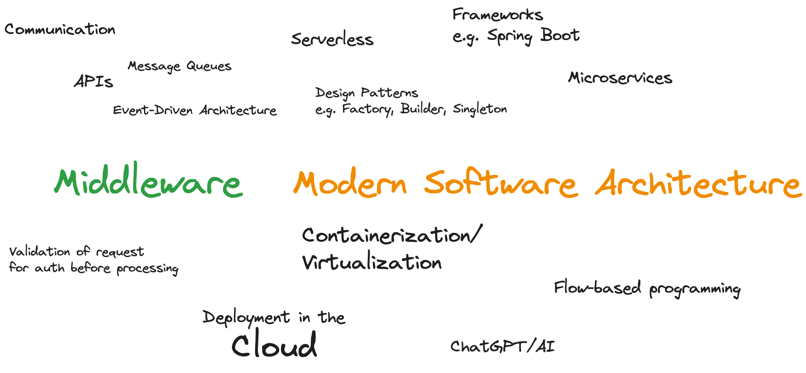
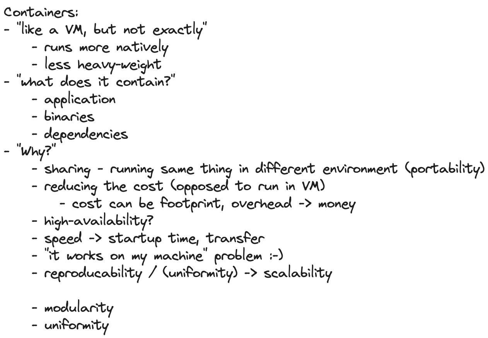

# 2023-10-06 Cloud and Semester Introduction

### Intro questions:

* Which technologies or what do you have in mind in general if you think about "middleware" and "modern software architecture"?
* the "WHY" - Why would people use and implement a distributed systems architecture?

### Sketches

### Content

* Why distributed systems, why middleware, why modern software?
* What is Cloud Computing? Encounters in everyday life and history
* Characteristic, advantages & challenges
* Terminology - public, private, hybrid, dedicated
* Abstraction layers - IaaS, PaaS, FaaS, SaaS
* Overview - Hypervisors, virtual machines, containers and orchestration

### Objectives and exercises
_The student is able to describe the reasons for distributed systems and
cloud computing in own words and list examples for offerings, topologies and technologies. Includes ability to differentiate between different abstraction layers and knowledge how those layers and according technologies interact with each other. No exercises in this module_

### Student Questions

- Would an nginx serve as a vertical or horizontal middleware component?
- Is horizontal and vertical middleware same as horizontal and vertical scaling?

### Links

- https://github.com/features/codespaces
- https://www.gitpod.io/

# 2023-10-13 Container Intro

# 2023-10-20 Container Labs

### Questions

- Is a docker Container capable of installing things through apt-get?
- What happens with the data if you start and stop the Postgres container?

### Links

- https://github.com/wagoodman/dive
- https://docs.docker.com/engine/reference/builder/#cmd
- https://docs.docker.com/engine/reference/builder/#entrypoint
- https://github.com/docker/awesome-compose/

# 2023-10-27 Introduction to Spring Boot

* Background: Spring Framework - History & components
* Spring ← → Spring Boot
* Spring Initializr (start.spring.io) & starter dependencies
* Basic project structure (folders, configuration ..)
* "Hello, World!" example explained
* Using Actuator

### Objectives

The student is able to build and configure an own Spring Boot application from scratch with the IDE of choice. The exercise is to build an own "Hello, World!" application that exposes various - endpoints and is able to execute CRUD operations on the state of the application. Optional: Add logging and testing, configure Actuator.

### Exercises

Basic setup:

- Set up an own gitlab or github repository
- Either set up an own local Java IDE or use gitpod.io

Helpful Links:

- https://github.com/
- https://gitlab.com/
- https://gitpod.io/
- https://www.gitpod.io/docs/introduction/languages/java

Application:

- Build your own first Spring Boot Hello, World application at 
- https://start.spring.io
- Change name, Java version, build tool, dependencies. Observe changes
- Use the following deps: Web, Actuator, DevTools
- Annotate a class with @RestController and expose "some" Rest Mappings
- Experiment with other Mappings, e.g. @GetMapping, @PostMapping
- Pass a parameter via @PathVariable

Helpful Links:

- https://start.spring.io
- https://www.baeldung.com/spring-requestmapping
- https://spring.io/guides#getting-started-guides
- Full tutorial (stuff for next weeks): https://www.baeldung.com/spring-boot-start
  
