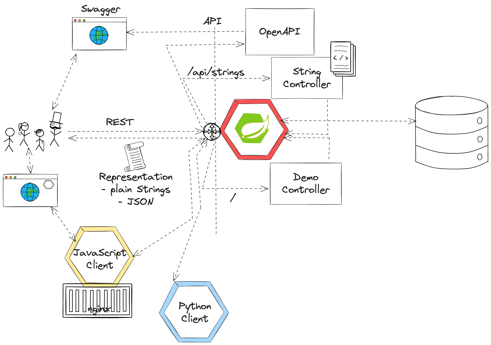
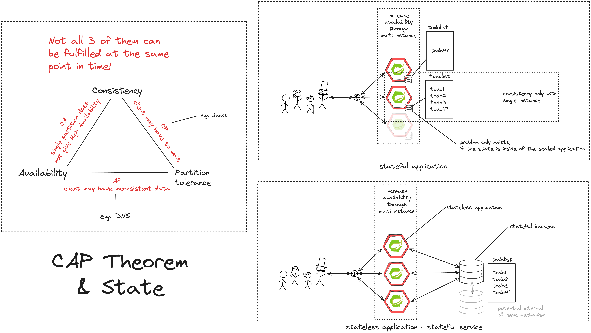
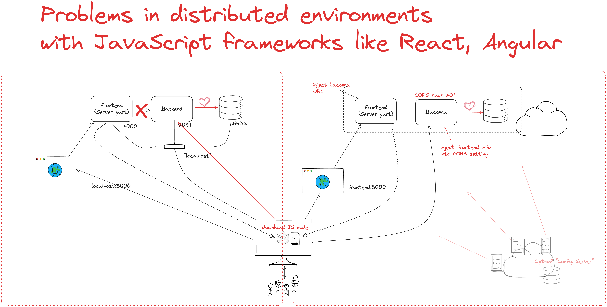
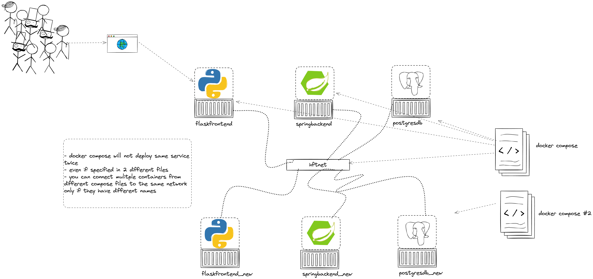
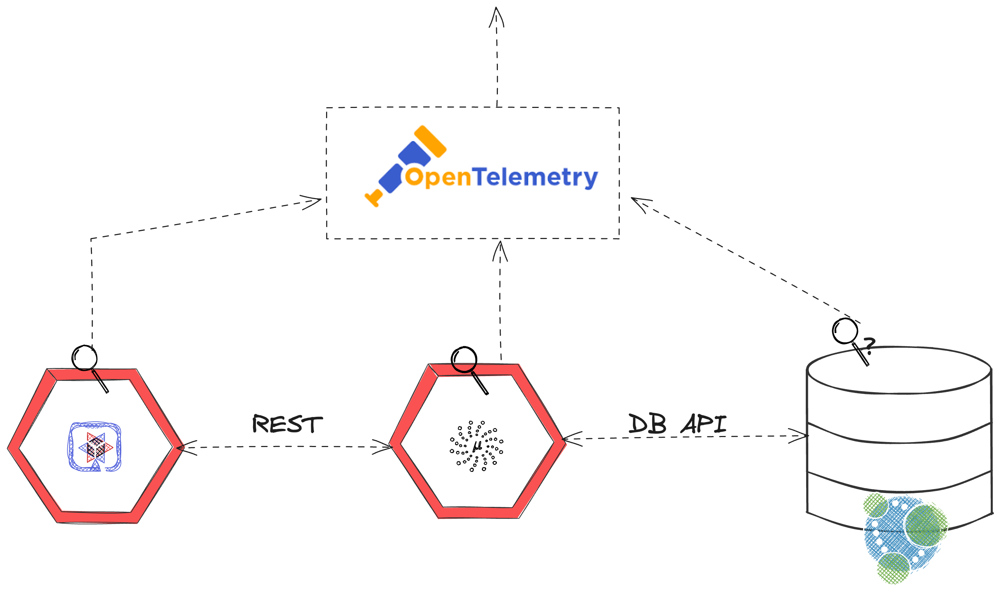
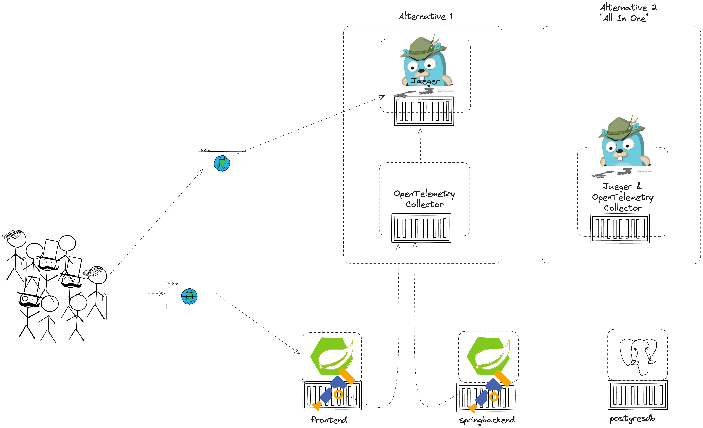
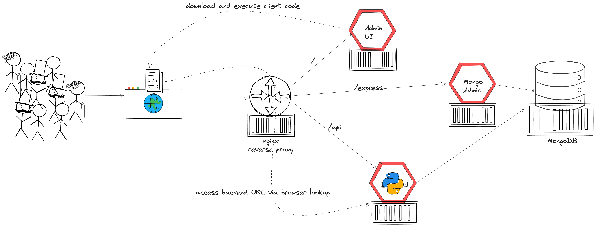

# 2023-10-06 Cloud and Semester Introduction

### Intro questions:

* Which technologies or what do you have in mind in general if you think about "middleware" and "modern software architecture"?
* the "WHY" - Why would people use and implement a distributed systems architecture?

## Sketches

### Braindump


### Vertical Middleware


### Horizontal Middleware


### Content

* Why distributed systems, why middleware, why modern software?
* What is Cloud Computing? Encounters in everyday life and history
* Characteristic, advantages & challenges
* Terminology - public, private, hybrid, dedicated
* Abstraction layers - IaaS, PaaS, FaaS, SaaS
* Overview - Hypervisors, virtual machines, containers and orchestration

### Objectives and exercises
_The student is able to describe the reasons for distributed systems and
cloud computing in own words and list examples for offerings, topologies and technologies. Includes ability to differentiate between different abstraction layers and knowledge how those layers and according technologies interact with each other. No exercises in this module_

### Student Questions

- Would an nginx serve as a vertical or horizontal middleware component?
- Is horizontal and vertical middleware same as horizontal and vertical scaling?

### Links

- https://github.com/features/codespaces
- https://www.gitpod.io/

# 2023-10-13 Container Intro


* What are containers and how do they work?
* Containers vs. VMs
* History of containers and rise of Docker
* Docker concepts: daemon, hub, dockerfile, CLI
* Running containers with various options

### Objectives

_The student understands the concepts and use cases of container technology and is able to describe them. The first exercise is to pull sample images from an image registry (e.g. Docker Hub) and interact with them (run, expose port, execute shell, cleanup etc). After that the student can show how to build a custom image via Dockerfile and push it to a registry for others to access. Complete the exercises handed out via URL._

### Exercises/Lab task

* Create or get yourself a Docker Id (https://www.docker.com)
* Get a github or gitlab id. A public one, please :-)
* Do the container lab given at: https://hsexd.new.trainings.nvtc.io/ (up until Networks)
* Create a docker-compose file to start all 3 containers in the exercise
* Optional: Externalize storage part of the database

# 2023-10-20 Container Labs

### Questions

- Is a docker Container capable of installing things through apt-get?
- What happens with the data if you start and stop the Postgres container?

### Review questions

* "WHY" Containers? List advantages/disadvantages ..
* What is the difference between a container and a VM? List 3 criteria
* Which technologies led to the evolution of docker (and why)? 
* What is the difference between a docker daemon and the docker hub? 
* What is the difference between docker run, docker pull and docker start?
* Which command transitions from a container instance to an image?
* What does docker commit have in common with docker build and what is the difference?
* What are the Docker components and describe them? (Rephrase!)
* What does docker exec do? Provide a pseudo-code example and explain what it does 
* Explain the container latest tag

### Links

- https://github.com/wagoodman/dive
- https://docs.docker.com/engine/reference/builder/#cmd
- https://docs.docker.com/engine/reference/builder/#entrypoint
- https://github.com/docker/awesome-compose/

# 2023-10-27 Introduction to Spring Boot


* Background: Spring Framework - History & components
* Spring ← → Spring Boot
* Spring Initializr (start.spring.io) & starter dependencies
* Basic project structure (folders, configuration ..)
* "Hello, World!" example explained
* Using Actuator

### Objectives

The student is able to build and configure an own Spring Boot application from scratch with the IDE of choice. The exercise is to build an own "Hello, World!" application that exposes various - endpoints and is able to execute CRUD operations on the state of the application. Optional: Add logging and testing, configure Actuator.

### Exercises

Basic setup:

- Set up an own gitlab or github repository
- Either set up an own local Java IDE or use gitpod.io

### Review questions

* "WHY Spring Boot?" Provide 3 advantages of this framework
* Describe Spring Boot to somebody not familiar with it in own words ()
* How do you start building a Spring Boot app? Initializr & Dependencies
* List 4 different starter dependencies and explain briefly what they do (old question) (4P)
"I did not do my lab task with Spring Boot. I implemented using Python and I can tell you how it works there ..."

### Helpful Links:

- https://github.com/
- https://gitlab.com/
- https://gitpod.io/
- https://www.gitpod.io/docs/introduction/languages/java

Application:

- Build your own first Spring Boot Hello, World application at 
- https://start.spring.io
- Change name, Java version, build tool, dependencies. Observe changes
- Use the following deps: Web, Actuator, DevTools
- Annotate a class with @RestController and expose "some" Rest Mappings
- Experiment with other Mappings, e.g. @GetMapping, @PostMapping
- Pass a parameter via @PathVariable
- Put your application into a Docker container

Helpful Links:

- https://start.spring.io
- https://www.baeldung.com/spring-requestmapping
- https://www.baeldung.com/spring-boot-actuator-enable-endpoints

# 2023-11-03 Deeper Dive into REST



* Synchronous communication
* HTTP and REST
* Verbs, Resources, Nouns
* Evolution, Richardson Maturity Model
* CRUD Operations
* Building a REST API with Spring (Boot)
* Building a data model with REST

Links:

* https://restfulapi.net/idempotent-rest-apis/
* https://restfulapi.net/richardson-maturity-model/
* https://en.wikipedia.org/wiki/List_of_HTTP_status_codes

* https://www.baeldung.com/spring-requestmapping
* https://www.baeldung.com/spring-request-response-body
* https://www.baeldung.com/spring-rest-openapi-documentation
* https://www.baeldung.com/spring-cors

### Review questions

* Identify good and bad API examples and explain why
* Describe the concepts of Verbs and Nouns
* When is an invocation idempotent and safe? What does it mean? Provide examples
* Describe in your own words the mapping of REST calls to database (SQL) and CRUD calls

### Objectives and exercises
_The student understands the concepts of an API and synchronous communication in distributed systems and can explain it in own words._

# 2023-11-10 Cloud-native Software development - Theory part

Theory lecture - Cloud-Native Software 

* CAP Theorem
* Conway's Law
* Fallacies of distributed computing
* Domain-Driven Design basics (not relevant for exam)
* 12-factor application
* Evolution of applications and deployments: Monolithic -> Service-Oriented Architecture -> Microservices
* Introduction to serverless and FaaS terminology

### Objectives and exercises
_The student knows about the evolution of distributed systems (and middleware) and the drivers towards state-of-the-art implementation and deployment. She/he can explain the underlying concepts and theories and put it into practical context. No dedicated exercises for this module. Recap of basics: Spring Boot, Docker, configuration._

### Review questions

* "WHY" Cloud-Native Software? What IS Cloud-Native Software?
* Why "evolution" from a monolithic approach to a distributed approach?
* How does the CAP Theorem/Conway's Law relate to this?
* (NO Domain-Driven Design questions)
* How do the 12-factor application "methodology" relate to the technologies that we covered in this semester? (important)
* "WHY" is external configuration important in cloud-native software?
* Where did you see aspects of external configuration in the technologies we used? Provide examples
* What is the advantage of polyglot applications? Why in particular for cloud-native software? What kind of disadvantages do you see?

# 2023-11-17 Cloud-native recap / Intro to persistence

### Revision of CAP Theorem



- State(full/less)ness

### Review question

- "WHY" should you not keep the state in memory, but persist it to a "storage backend"

### Example Spring Data JPA

* Spring Data
* Concept of entities and repositories
* JPA and JDBC basics
* H2, PostgeSQL, MySQL - configuration via Spring Boot profiles
* Running databases as Docker images


### Objectives and exercises
_The student is able to build a Spring Boot application (or extend an existing one) with Spring Data configuration. The exercise is to create an application, which performs CRUD operations on a database backend. The database can either be in-memory (H2) or a (containerized) PostgreSQL or whatever you like. Provide a docker-compose file to stand up a multi-container environment with application and database._

### Review Questions

* "WHY" persistence? "WHY" should you not keep the state in memory, but persist it to a "storage backend"
* "WHY" persistence frameworks like JPA?
* Describe the necessary components to build an application with Spring Data or any programming language framework of your choice? Potentially sketch
* What does the annotation @Entity do? 
* How could docker compose help if you have a persistence-based application?

# 2023-11-24 Recap of the 12-factor / Docker Advanced

### 12-factor Recap


### "docker run" vs "docker compose"


### Review questions

* Why is it a bad idea to have configuration properties as constants in your code?
Answers: Security issue with credentials, Can't stage because of strong dependency to one certain environment
* Why did this become a lot more important when moving from traditional to cloud-native applications
Answers: Applications have more frequent changes and scale. The demand to update configuration is much higher

* Where did you see aspects of factor 3 "external configuration" in the technologies we have dealt with?
Docker: "docker run -e ENVIRONMENT VARIABLES" or "docker run -env-file ENV_FILE", docker compose tbd, volumes tbd
Spring Boot: pom.xml declared dependencies externally, application.properties/application.yaml, environment variables

* Where did we see aspects of factor 1 "Codebase": git*
* Where did we see aspects of factor 2 "External Dependencies" : maven, gradle, npm
* Where did we see aspects of factor 4 "Backing Services": Spring Data (Hibernate/JPA)

# 2023-12-01 No lecture - project week

# 2023-12-08 Code review

### Client-side JavaScript "problem"


### Multiple docker compose files with shared network


###Review questions
* What is the limitation of dependson in a docker compose?
* Why is the waiting service still able to call the other one too early?

# 2023-12-15 Introduction to observability with OpenTelemetry

* Why is there a need for monitoring and observability?
* Concept of distributed tracing - What is a trace? What is a span?
* OpenTelemetry as Open Source solution to address this problem
* Different ways of implementation: "Automatic" vs "Programmatic"
* Jaeger as technology to visualize distributed traces

### Objectives and exercises

The student is able to explain why observability is important and what the challenges of modern software (e.g. polyglot, distributed microservices) are. The student is able to use OpenTelemetry with auto-configuration to monitor an application, as well as configuring the agent to send the data to a collector. The student is able to read and describe a distributed trace in e.g. Jaeger.

### Basic OpenTelemetry concept


### Alternatives for collection and visualization


# 2023-12-22 Semester Recap and Lab Reviews



* Multi-Stage Dockerfile

```
FROM maven:3-eclipse-temurin-21 AS build
RUN mkdir -p /opt/app/src
WORKDIR /opt/app
COPY src /opt/app/src
COPY pom.xml /opt/app
RUN mvn clean package -DskipTests

FROM eclipse-temurin:21-jre
RUN mkdir -p /opt/app
COPY --from=build /opt/app/target/demo-0.0.1-SNAPSHOT.jar /opt/app.jar
EXPOSE 8090
CMD ["java","-jar","/opt/app.jar"]
```

* Docker Compose Healthchecks

```
  backend:
    build: ./backend
    ports:
      - '8090:8080'
    networks:
      - comiclib-network
    depends_on:
      - database
    healthcheck: 
      test: "nc -v -z localhost 8080" # healthcheck is executed IN the container and NOT on the container daemon!
      interval: 2s
      timeout: 10s
      retries: 10
      start_period: 4s
      start_interval: 5s
```

* nginx Reverse Proxy

```
  http {
    sendfile on;
    upstream admin-frontend {
        server admin-frontend;
    }
    upstream backend {
        server backend:8080;
    }
    upstream mongo-express {
        server mongo-express:8081;
    }
    server {
        listen 80;
        location /api {
            proxy_pass http://backend;
        }
        location / {
            proxy_pass http://admin-frontend;
        }
        location /express {
            proxy_pass http://mongo-express;
        }
    }
  }
```

### Links:

* https://phoenixnap.com/kb/nc-command
* https://12factor.net/dev-prod-parity
* https://github.com/dart-lang/dart-docker/issues/58
* https://github.dev/maeddes/options-galore-container-build
* https://docs.docker.com/compose/compose-file/05-services/#healthcheck

# 2024-01-12 Semester Recap I

### Student questions:
- Or should I also know the ins and outs of spring boot and app dev for example?


### Contents

* Spring Boot Recap
  - Advantages
  - Initializr & Dependencies